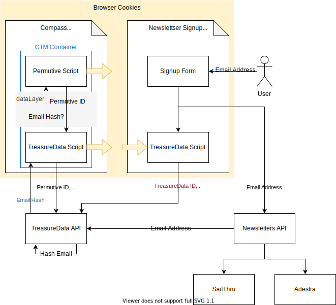

# Newsletters

When a user subscribes to a newsletter we accociate the email address they
provide with their existing record in the TreasureData CDP. To do this we need
to pass the TreasureData ID and the email address to TreasureData so the email
address can be associated with the correct record.

Edit [newsletters-flow.drawio](diagrams/newslwtters-flow.drawio) with draw.io
