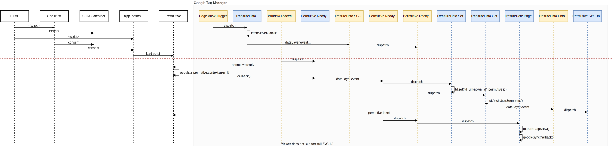

# TreasureData & Permutive Implementation with Google Tag Manager

In the majority of cases we use, or intend to use Google Tag Manager(GTM) to
manage third party integrations running on our page, wherever possible.

We use both Permutive and TreasureData amongst other third party technologies to
track users as they visit our pages. Both of these ecosystems provide
identifiers that need to be shared between the systems to be most effective.
This document records the steps required to integrate Permutive and TreasureData
on a Condé Nast site using GTM.

Permutive is a third party Data Management Platform (DMP). Unlike the majority
of other integrations done using GTM, Permutive is integrated into our sites
using a javascript tag that must be included directly in the head tag of the
page. The instructions for integrating Permutive on a site can be found here
https://developer.permutive.com/docs/web ARM TreasureData is a Customer Data
Platform (CDP).

Where possible we will integrate TreasureData with Condé Nast sites using GTM.
This means that concerns like consent compliance and the order of loading
dependencies is managed in GTM rather than being tightly coupled in javascript
source code of our sites. The instructions for integrating TreasureData on a
site tiwout GTM can be found here
https://tddocs.atlassian.net/wiki/spaces/PD/pages/1081498/Web+Tracking and the
documentation of the TreasureData Javascript SDK is here
https://github.com/treasure-data/td-js-sdk

To configure Permutive and TreasureData to operate on a page and share the
required information we will need to add the following to our GTM configuration.

# Sequence Diagram

 Edit
[sequence-diagram.drawio](diagrams/sequence-diagram.drawio) with draw.io

# Tags

## TreasureData Tag

Initializes the TreasureData Javascript SDK and fetches the sever-side cookie.

Triggers on **Page View**

```html
<script type="text/javascript">
  !(function (t, e) {
    if (void 0 === e[t]) {
      (e[t] = function () {
        e[t].clients.push(this),
          (this._init = [Array.prototype.slice.call(arguments)]);
      }),
        (e[t].clients = []);
      for (
        var r = function (t) {
            return function () {
              return (
                (this["_" + t] = this["_" + t] || []),
                this["_" + t].push(Array.prototype.slice.call(arguments)),
                this
              );
            };
          },
          s = [
            "blockEvents",
            "setSignedMode",
            "fetchServerCookie",
            "unblockEvents",
            "setSignedMode",
            "setAnonymousMode",
            "resetUUID",
            "addRecord",
            "fetchGlobalID",
            "fetchUserSegments",
            "set",
            "trackEvent",
            "trackPageview",
            "trackClicks",
            "ready",
          ],
          n = 0;
        n < s.length;
        n++
      ) {
        var o = s[n];
        e[t].prototype[o] = r(o);
      }
      var c = document.createElement("script");
      (c.type = "text/javascript"),
        (c.async = !0),
        (c.src =
          ("https:" === document.location.protocol ? "https:" : "http:") +
          "//cdn.treasuredata.com/sdk/2.2/td.min.js");
      var i = document.getElementsByTagName("script")[0];
      i.parentNode.insertBefore(c, i);
    }
  })("Treasure", this);
</script>

<script>
  (function(win,doc,tdName){
    var td = win[tdName] = new Treasure({
      host: 'eu01.in.treasuredata.com',
      database: {{TreasureData Database}},
      writeKey: {{TreasureData Write Key}},
      trackCrossDomain: true,
      startInSignedMode: true,
      useServerSideCookie: true
    });

    function sscSuccessCallback (result) {
      td.set("$global", "td_ssc_id", result);
      dataLayer.push({
        event: "td_ssc_id_success",
        td_ssc_id: result
      });
    }

    function sscErrorCallback () {
      dataLayer.push({
        event: "td_ssc_id_failed"
      });
    }

    td.set("$global","td_global_id","td_global_id");
    td.fetchServerCookie(sscSuccessCallback, sscErrorCallback);
  })(window, document, {{TreasureData Instance Name}});
</script>
```

## Permutive Ready Tag

Waits for permutive to be ready and then pushes the permutive user id into the
data layer so other tags can use it.

Trigger as soon as `permutive` is defined.

Conventionally this would be **Page View** however for the
[Compass Rocket](https://github.com/condenast/rocket) application this needs to
be **Window Load** because the permutive implementation is not included in the
html `<head>` tag.

```html
<script>
  if (permutive && permutive.ready) {
    permutive.ready(function () {
      dataLayer.push({
        event: "permutive_ready",
        permutive_user_id: permutive.context.user_id,
      });
    });
  } else {
    console.error("Permutive not available");
  }
</script>
```

## TreasureData Set Permutive ID Tag

Sets the permutive user id on all calls to TreasureData

Triggers on [Permutive Ready](#permutive-ready-trigger)

```html
<script>
  (function(win,doc,tdName){
    var td = win[tdName];
    td.set('$global', 'td_unknown_id', {{Permutive User ID}});
    permutive.identify([{
      tag: "td_unknown_id",
      id: {{Permutive User ID}},
      priority: 0
    }]);
  })(window, document, {{TreasureData Instance Name}});
</script>
```

## TresureDate PageView Tag

Calls TreasureData `trackEvent` to record the page view then passes the TreasuerData user id to
Google.

Triggers on
[Permutive Ready and TresureData SCC](#permutive-ready-and-tresuredata-scc-trigger)

```html
<script>
  (function(win,doc,tdName){
    var td = win[tdName];
  
    function googleSyncCallback() {
      var gidsync_url = '//cm.g.doubleclick.net/pixel?';
      var params = [
        'google_nid=treasuredata_dmp',
        'google_cm',
        'td_write_key=' + {{TreasureData Write Key}},
        'td_global_id=td_global_id',
        'td_client_id=' + td.client.track.uuid,
        'td_host=' + doc.location.host,
        'account=' + {{TreasureData Account ID}}
      ];
      var img = new Image();
      img.src = gidsync_url + params.join('&');
    }

    // Define event data
    var data = {};
    data["userAgent"] = {{userAgent}};
    data["pageURL"] = {{pageURL}};
    data["pageTitle"] = {{pageTitle}};
    // ...add more values as required here...

    // Send pageview event along with additional data
    td.trackEvent(
      {{TreasureData Pageview Event}},
      data,
      googleSyncCallback,
      googleSyncCallback
    );
  })(window, document, {{TreasureData Instance Name}});
</script>
```

## Permutive Set Email Hash Tag

Calls Permutive `identify` to pass the email hash.

Triggers on [TresureData Email Hash](#tresuredata-email-hash-trigger)

```html
<script>
  (function(win){
    var permutive = win["permutive"];
    permutive.ready(function() {
      permutive.identify([{
        tag: "email_sha256",
        id: {{Email Hash}},
        priority: 1
      }]);
    });
  })(window);
</script>
```

## TreasureData Get Email Hash Tag

Calls TreasureData with the permutive id to get the email hash and fire the
[TresureData Email Hash](#tresuredata-email-hash-trigger) custom event.

Triggers on [Permutive Ready](#permutive-ready-trigger)

```html
<script>
  (function(win, tdName){
    var td = win[tdName];
    function success(values) {
      if(
        values.length > 0 &&
        values[0].attributes &&
        values[0].attributes.email_sha256
      ){
        var email_sha256 = values[0].attributes.email_sha256;
        dataLayer.push({
          "event":"email_hash",
          "email_sha256": email_sha256
        });
      }
    }
    function error(err) {
      console.log(err);
    }
    td.fetchUserSegments({
      audienceToken: {{TreasureData Write Key}},
      keys: {"permutive_id": {{Permutive User Id}}}
    }, success, error);
  })(window, {{TreasureData Instance Name}});
</script>
```

# Triggers

Fires when Permutive has loaded and set the
[Permutive User ID](#permutive-user-id) variable

## Permutive Ready Trigger

| Property              | Value             |
| --------------------- | ----------------- |
| Trigger Type          | Custom event      |
| Event Name            | `permutive_ready` |
| Use regex matching    | No                |
| This trigger fires on | All Custom Events |

## TresureData SCC Trigger

Fires when the server-side-cookie is received or the request fails.

| Property              | Value             |
| --------------------- | ----------------- |
| Trigger Type          | Custom event      |
| Event Name            | `/^td_scc_.*/`    |
| Use regex matching    | Yes               |
| This trigger fires on | All Custom Events |

## Permutive Ready and TresureData SCC Trigger

Fires when _both_ the [Permutive Ready](#permutive-ready-trigger) and
[TresureData SCC](#tresuredata-scc-trigger) triggers have fired.

| Property              | Value                                                                                       |
| --------------------- | ------------------------------------------------------------------------------------------- |
| Trigger Type          | Trigger Group                                                                               |
| Triggers              | [Permutive Ready](#permutive-ready-trigger) and [TresureData SCC](#tresuredata-scc-trigger) |
| This trigger fires on | All Conditions                                                                              |

## TresureData Email Hash Trigger

Fires when the user's email hash is received.

| Property              | Value             |
| --------------------- | ----------------- |
| Trigger Type          | Custom event      |
| Event Name            | `email_hash`      |
| Use regex matching    | No                |
| This trigger fires on | All Custom Events |

# Variables

## Email Hash

Hash of the user's email address.

| Property            | Value               |
| ------------------- | ------------------- |
| Variable Type       | Data Layer Variable |
| Data Layer Variable | `email_sha256`      |
| Data Layer Version  | Version 2           |
| Set Default Value   | No                  |

## Permutive User ID

Unique ID of the user received from Permutive.

| Property            | Value               |
| ------------------- | ------------------- |
| Variable Type       | Data Layer Variable |
| Data Layer Variable | `permutive_user_id` |
| Data Layer Version  | Version 2           |
| Set Default Value   | No                  |

## TreasureData Database

Name of the TreasureData database to store values. You can see this list of
databases in the console https://console.eu01.treasuredata.com/app/databases

| Property      | Value                 |
| ------------- | --------------------- |
| Variable Type | Constant              |
| Value         | `cdp_audience_109553` |

## TreasureData Instance Name

Name of the globally scoped variable that holds the instance of the TreasureData
javascript SDK. IN documentation examples this is usually `td`. A constant is
used incase this needs to be changed to avoid collisions with other variables on
the page.

| Property      | Value    |
| ------------- | -------- |
| Variable Type | Constant |
| Value         | `td`     |

## TreasureData Write Key

Key identifying the client with permission to send data to TreasureData. This
should be available in the TreasureData console under “Profile API Tokens”

| Property      | Value                                  |
| ------------- | -------------------------------------- |
| Variable Type | Constant                               |
| Value         | `75b7e70b-b035-4c9c-8b0d-4cfbfe712c00` |

## TreasureData Account ID

The ID of the account with TreasureData. This will be in a format like this:
`eu01-01`.

| Property      | Value     |
| ------------- | --------- |
| Variable Type | Constant  |
| Value         | `eu01-57` |
